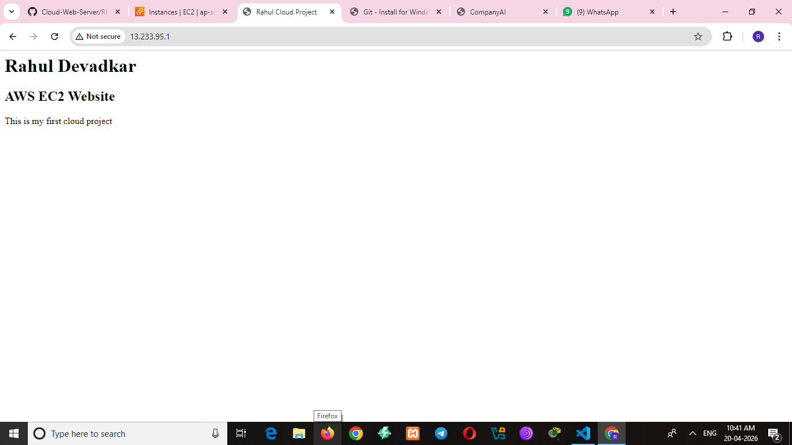
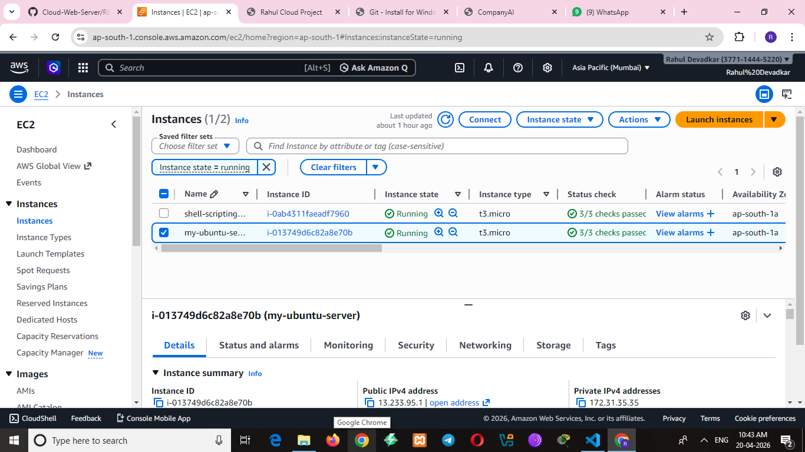

# 🚀 AWS EC2 Web Server Deployment Project

## 📌 Project Overview
This project demonstrates deploying a static website on a cloud server using AWS EC2 and Nginx.  
The goal was to understand cloud infrastructure, server configuration, and basic automation.

---

## 🏗️ Architecture
User → Internet → AWS EC2 → Nginx → Website

---

## 🛠️ Technologies Used
- Amazon Web Services (EC2)
- Ubuntu Linux
- Nginx Web Server
- Git & GitHub
- Shell Scripting (Bash)

---

## ⚙️ Implementation Steps

### 1. EC2 Setup
- Launched Ubuntu EC2 instance
- Configured Security Group (Port 22, 80)

### 2. Server Configuration
- Connected using SSH
- Updated system packages

### 3. Web Server Setup
- Installed Nginx
- Started and enabled service

### 4. Website Deployment
- Created index.html
- Deployed to /var/www/html

### 5. Automation
- Created deploy.sh script
- Automated installation and deployment

## Live Demo
http://13.233.95.1     (Your public ip)

## 📸 Project Screenshots

 

---

## 🔑 Key Learnings
- Launching and managing EC2 instances  
- Linux server configuration  
- Web server deployment using Nginx  
- Basic automation using shell scripting  
- Version control using Git  

---

## 🚀 Future Improvements
- Add custom domain (Route 53)  
- Enable HTTPS (SSL certificate)  
- Automate deployment using CI/CD  
- Dockerize the application  

---

## 👨‍💻 Author
*Rahul Devadkar*

---

## ⭐ Acknowledgement
This project is part of my Cloud/DevOps learning journey.